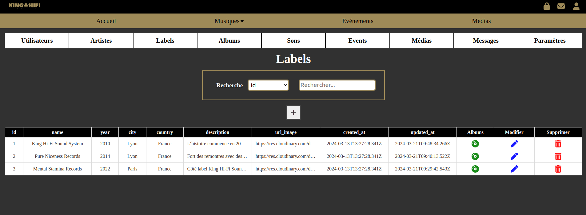
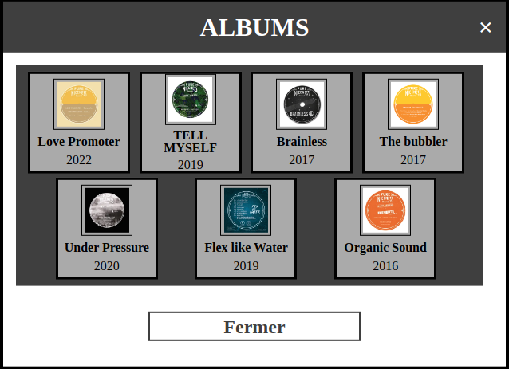
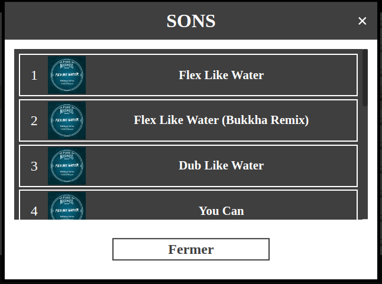
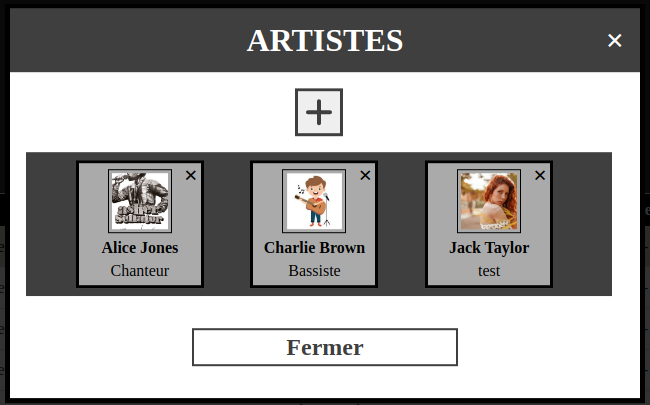
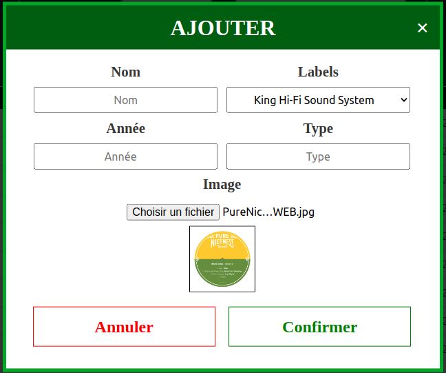
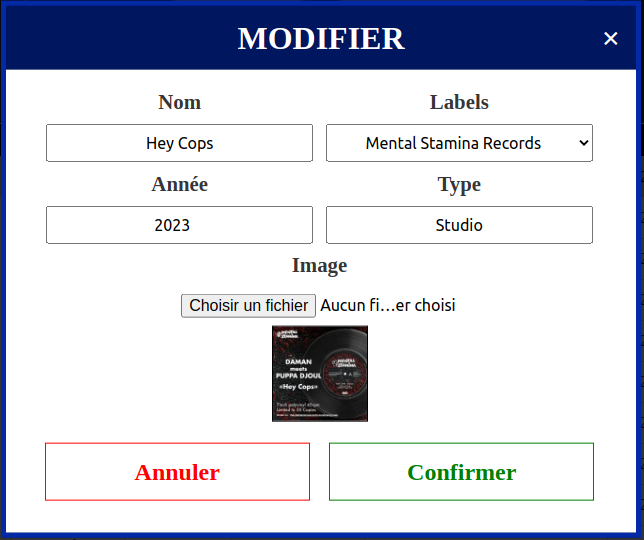
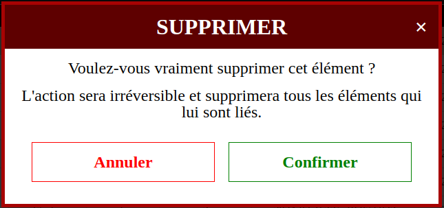
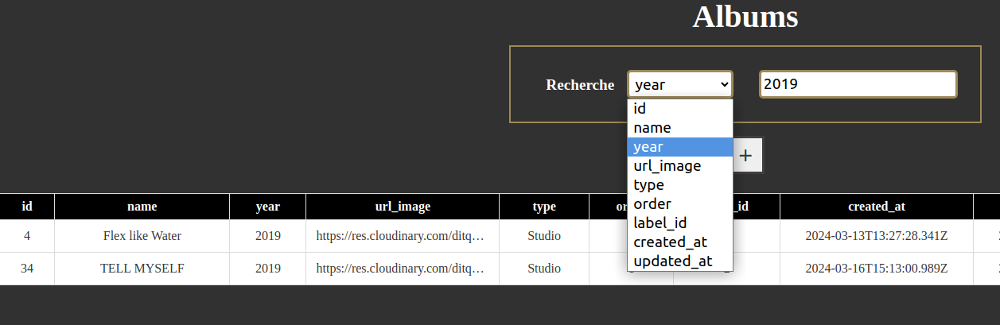

# King HIFI

## Description

Ce dépôt contient une application web destinée à un véritable groupe de musique (Sound system Dub) King HIFI.

**Temps de projet** : 1 mois (projet de fin de formation), réalisé à 4: méthodes Agile, Scrum, Kanban

**Accessible à cette adresse** : [King HIFI](https://pureniceness-front-6a800c130dfe.herokuapp.com/)

## Technologies principales

- React
- Vite
- CSS / Bulma

## Technos utilisées

- **React**: Bibliothèque JavaScript pour la construction d'interfaces utilisateur interactives.
- **Vite**: Outil de développement rapide et léger pour les applications web basées sur JavaScript et TypeScript.
- **CSS (Cascading Style Sheets)**: Langage de style pour la présentation des documents HTML.
- **SortTableJs**: Bibliothèque JavaScript pour le tri (drag and drop) des tableaux HTML.
- **Bulma**: CSS moderne et léger pour la conception d'interfaces utilisateur.
- **Fetch**: API JavaScript pour effectuer des requêtes réseau et récupérer des ressources depuis un serveur.
- **React-router**: Bibliothèque pour la gestion des routes dans les applications React.
- **JWT**: JSON Web Token utilisé pour l'authentification et l'échange sécurisé d'informations.
- **toastify**: Bibliothèque JavaScript pour afficher des notifications à l'utilisateur.
- **react-h5-audio-player**: Composant React pour la lecture audio dans les applications web.

## Fonctionnalités

- Gestion administrateur (back-office)
- Controle total sur les données via le back office (CRUD), rendant le site complétement dynamique et autonome.
- Recherche dynamique pour tous les éléments du site
- Modales pour les formulaires
- Gestion et optimisation des images avec cloudinary
- Gestion des sons avec google drive (streaming)
- Ordonner les albums, les sons, les artistes via la back office
- Authentification sécurisé
- Gestion des rôles
- Page d'accueil regroupant la description des labels
- Page musique regroupant tous les albums par label, ainsi que tous leurs sons
- Ecoute de sons tout en naviguant sur le site
- Ajout de sons aux favoris
- Page médias regroupant les images et vidéos du groupe
- Page évènements regroupant tous les évènements à venir et passés
- Page profil regroupant les informations de l'utilisateur ainsi que sa playlist (favoris)
- Possibilités de modifier ses informations et son mot de passe
- Page contact afin de contacter les membres du groupe en cas de collaboration, problèmes sur le site ou autres
- Notifications pour les actions de l'utilisateur
- ...

## Quelques captures d'écran du back office

### Tableaux de données

### Ordonner les albums pour un label via le drag and drop

### Ordonner les sons pour un album via le drag and drop

### Ordonner les artistes pour un son via le drag and drop

### Modale de création

### Modale de modification

### Modale de suppression

### Recherche en temps réel

